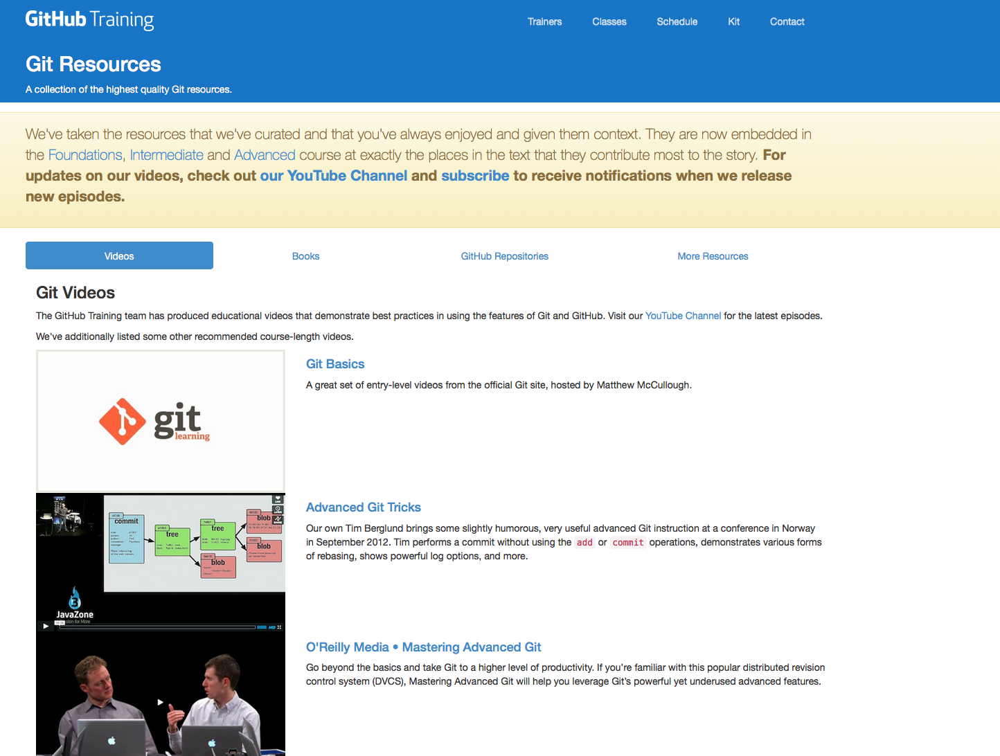
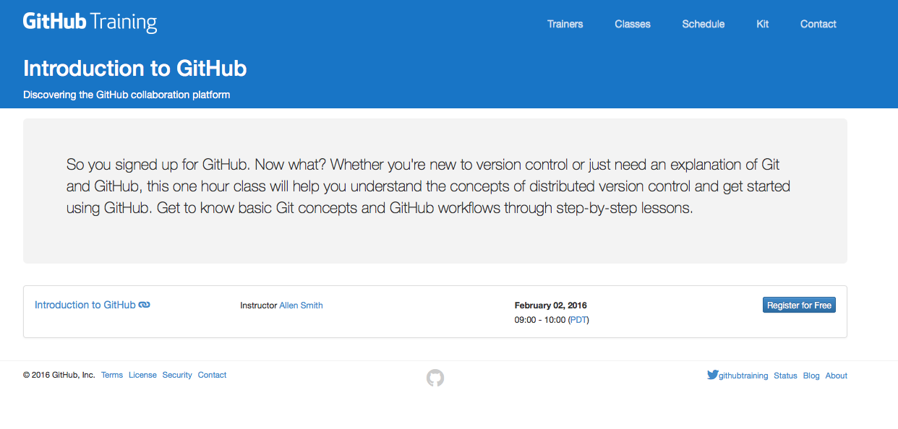
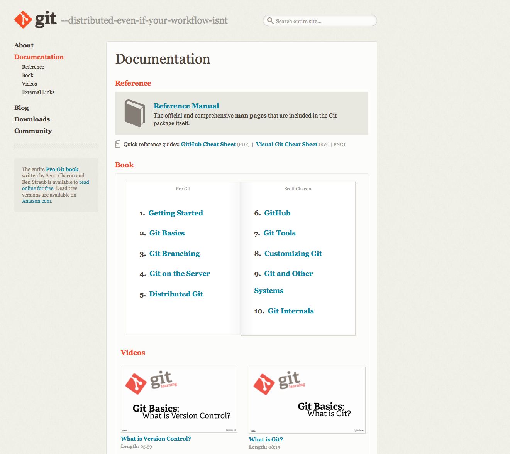
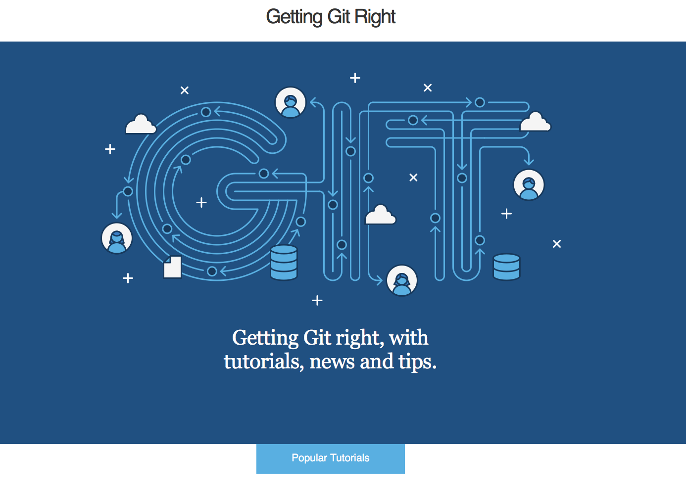
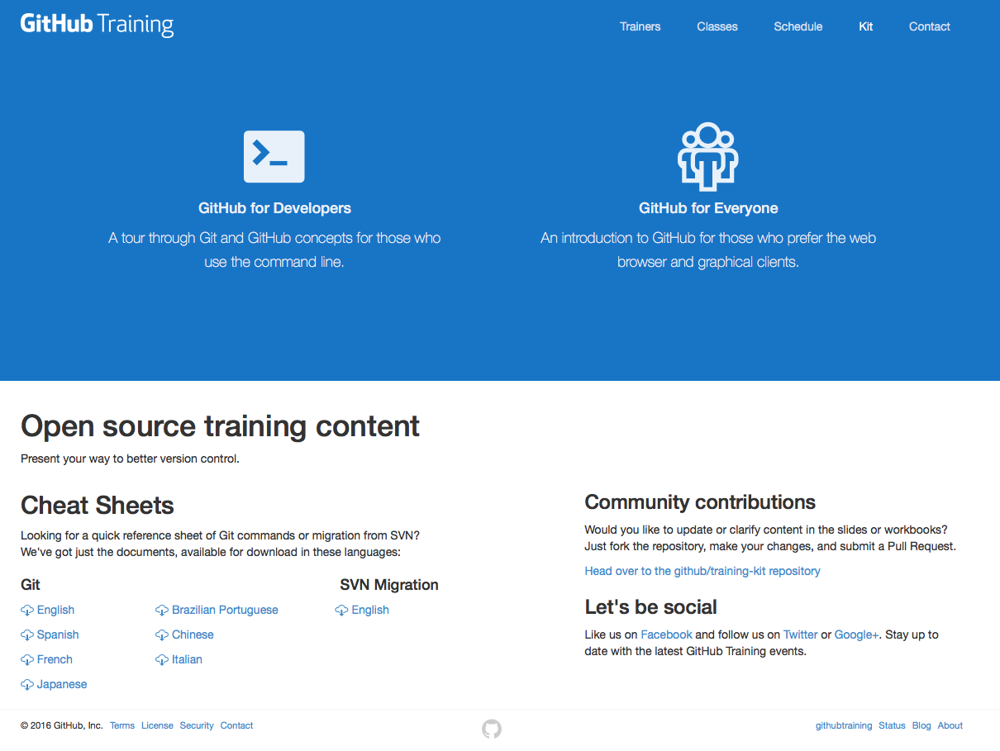
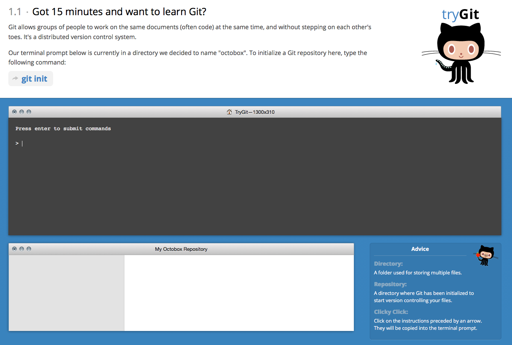
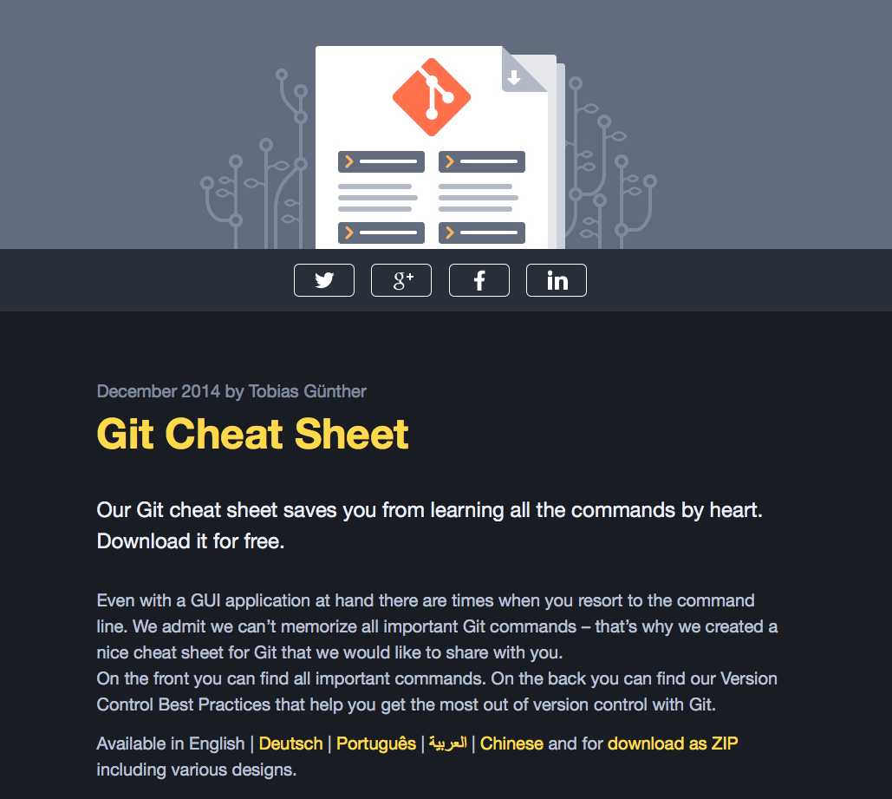

# git resources
================
A list of resources to learn git, github, and transitioning from svn to git.

--------------------------------------------------------------------------------------------------------------------------------------
- [Migration Path Slide Deck ](https://docs.google.com/presentation/d/1HPNp9ArYegCdbhs6kevKcbQ8gHCm8uG6j3vcMtwwerw/edit#slide=id.p)  

- [Official Github training videos](https://training.github.com/resources/videos/)  

- [Introduction to GitHub webinar sign up](https://training.github.com/classes/introduction/)  

- [The official git-scm reference manual](https://git-scm.com/doc)  

- [Git tutorials sponsored by Atlasian](https://www.atlassian.com/git/)  

- [The GitHub training kit](https://training.github.com/kit/)  
    
- [Interactive command line tutorial via your web browser](https://try.github.io/levels/1/challenges/1)  

- [A two page printable cheat sheet sponsored by the Tower Git Client](http://www.git-tower.com/blog/git-cheat-sheet/)  
