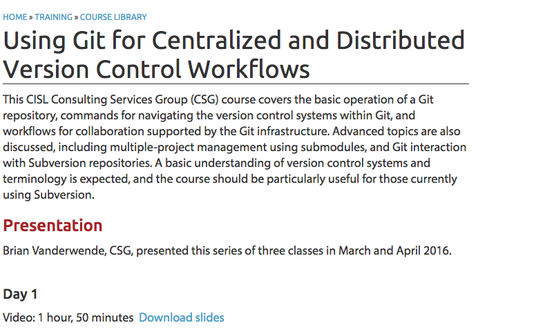
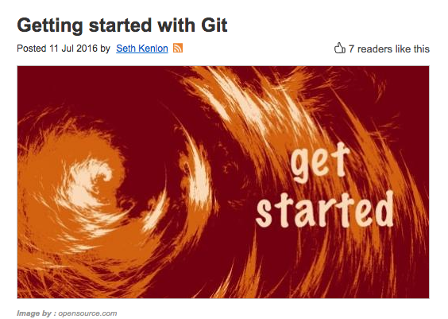
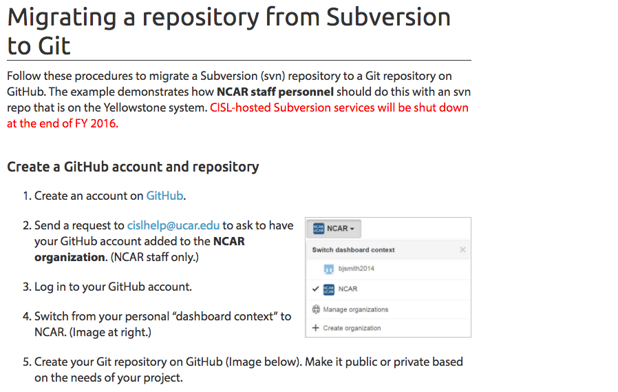
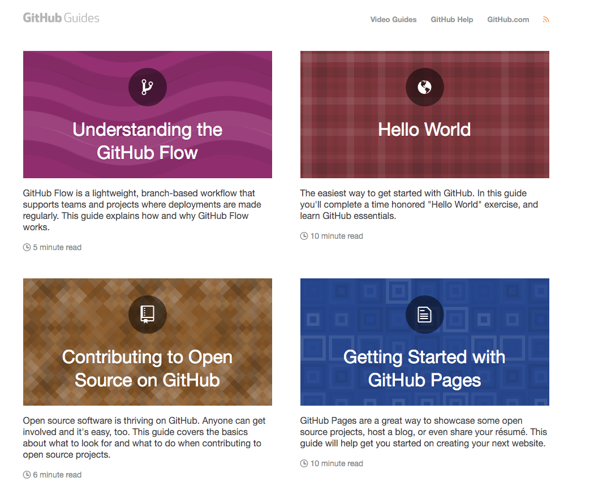
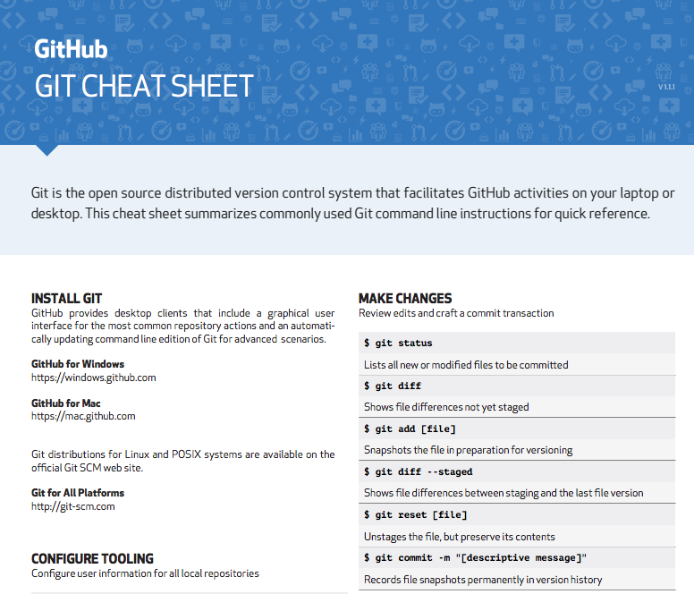
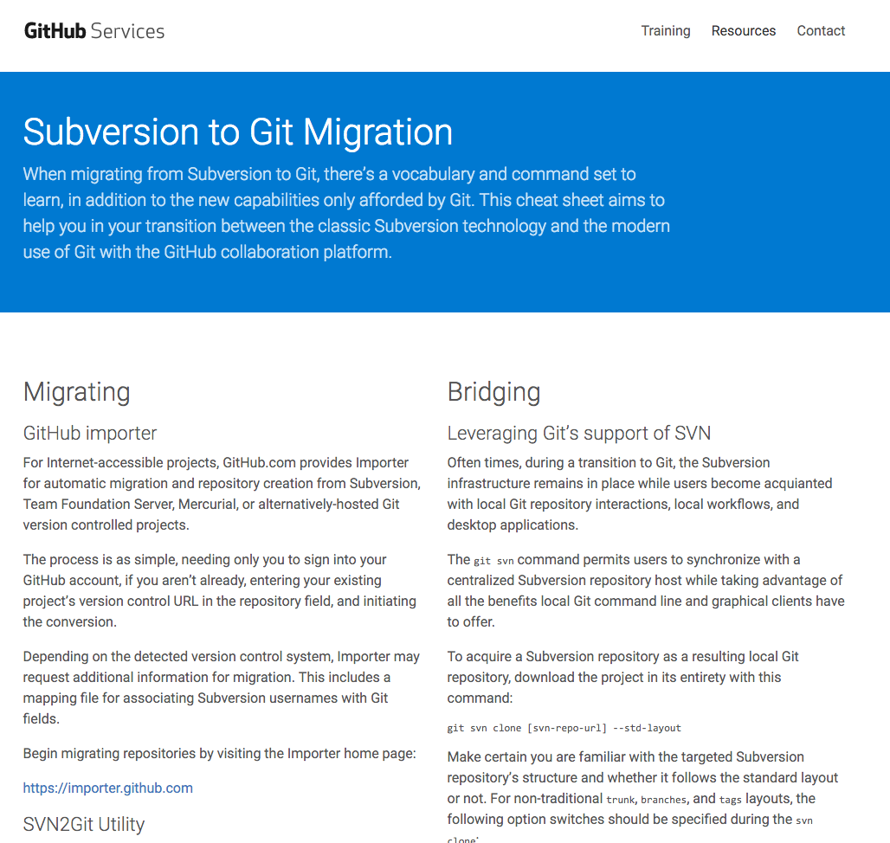
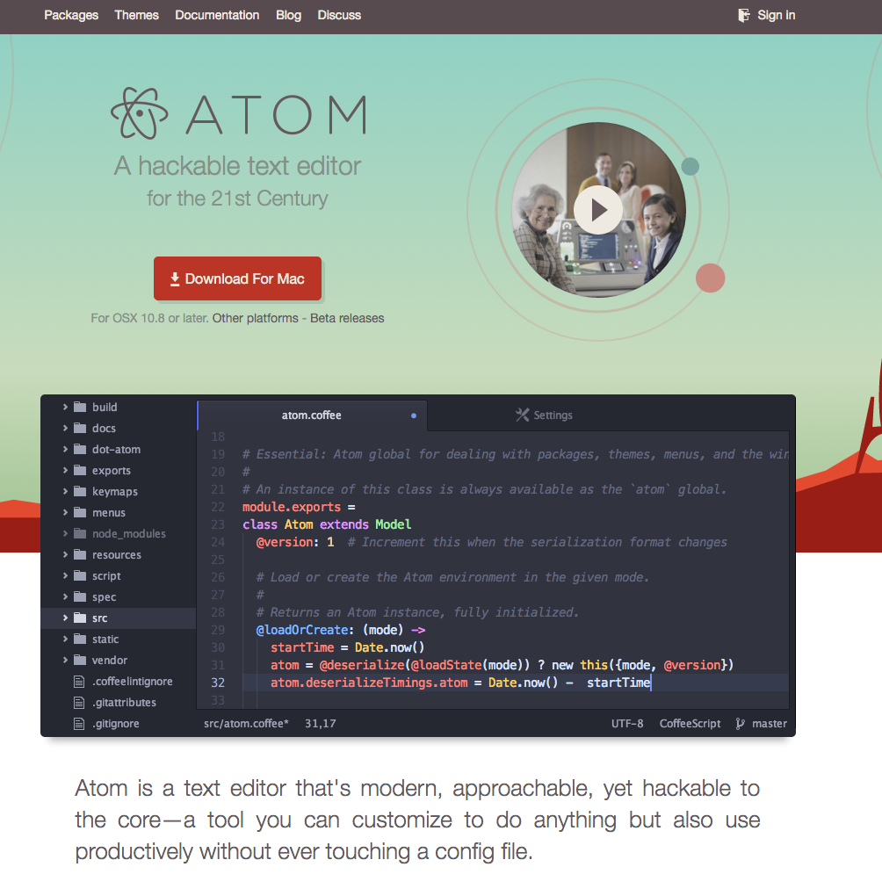

# git resources
================

## A curated list of resources to learn git, Github, and transitioning from svn to git.

--------------------------------------------------------------------------------------------------------------------------------------
- [Git Classes](https://www2.cisl.ucar.edu/user-support/training/library/using-git-centralized-and-distributed-version-control-workflows) 

- [Getting Started with Git](https://opensource.com/life/16/7/stumbling-git) 

- [Migration Guide](https://www2.cisl.ucar.edu/resources/computational-systems/yellowstone/software/migrating-repository-subversion-git) 

- [Migration Path Slide Deck ](https://docs.google.com/presentation/d/1HPNp9ArYegCdbhs6kevKcbQ8gHCm8uG6j3vcMtwwerw/edit#slide=id.p) 

- [Official Github training Guides](https://guides.github.com/) 

- [Official Github training videos](https://training.github.com/resources/videos/) 

- [Introduction to GitHub webinar sign up](https://training.github.com/classes/introduction/) 

- [The official git-scm reference manual](https://git-scm.com/doc) 

- [Git tutorials sponsored by Atlasian](https://www.atlassian.com/git/) 

- [The GitHub training kit](https://training.github.com/kit/) 

- [A two page printable cheat sheet from Github](https://training.github.com/downloads/github-git-cheat-sheet.pdf) 

- [Subversion to Git Migration](https://training.github.com/downloads/subversion-migration.html) 

- [Interactive command line tutorial via your web browser](https://try.github.io/levels/1/challenges/1) 

- [A two page printable cheat sheet sponsored by the Tower Git Client](http://www.git-tower.com/blog/git-cheat-sheet/) 

- [The Atom text editor for Windows, Mac & Linux](https://atom.io/) 
